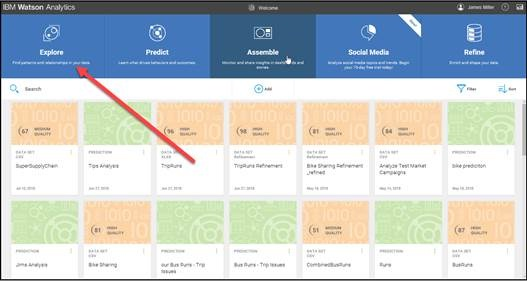
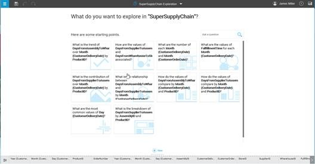
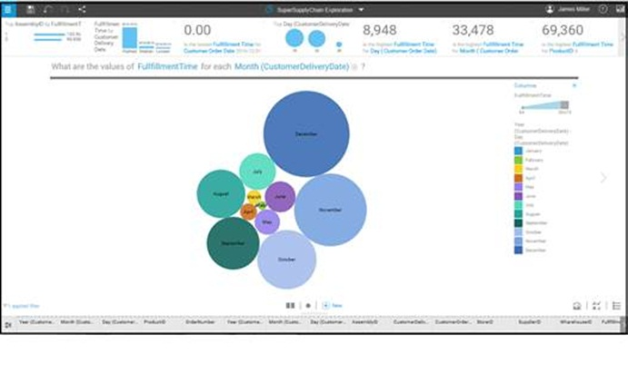
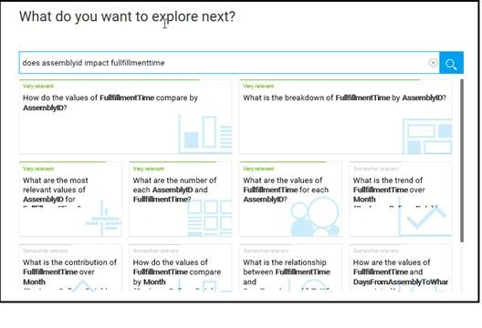
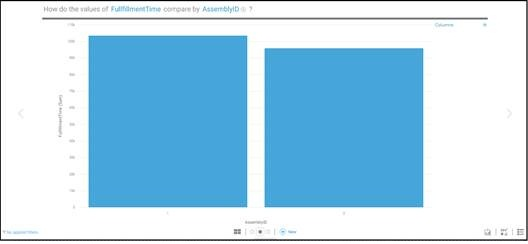
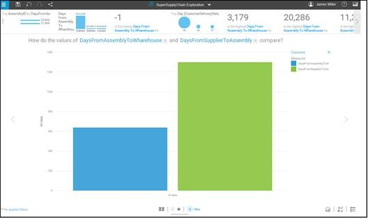
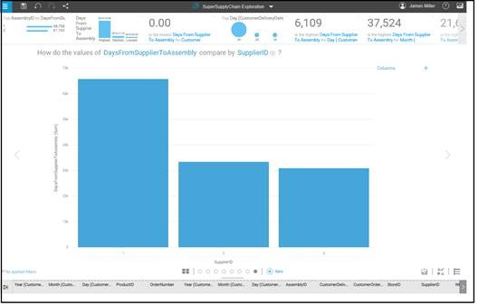
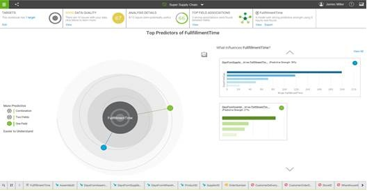
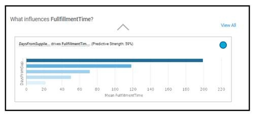
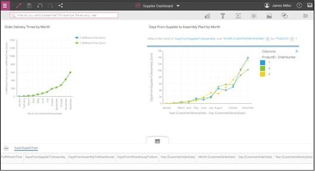

# An Automated Supply Chain Scenario
Aktivitas rantai pasokan mencakup mengubah sumber daya alam (dan lainnya), bahan mentah, dan komponen menjadi produk jadi yang kemudian dikirim ke pelanggan akhir saat pelanggan membutuhkan atau menginginkannya. Jadi, tidak hanya mengurus inventaris dan pengiriman produk. Rantai pasokan jauh lebih terlibat dan kompleks.

Dalam project ini kami akan berfokus pada analisis seberapa efektif rantai pasokan/supply chain untuk department store ritel. Skenario rantai pasokan otomatis ini akan memberikan wawasan ke dalam data dan proses dari organisasi rantai pasokan, dalam upaya untuk mengisolasi penyebab kinerja pengiriman yang buruk.

## Permasalah
Aktivitas rantai pasokan yang berkaitan dengan tahap bahan baku dikenal sebagai aktivitas hulu (upstream activities) dan aktivitas antara produsen dan konsumen akhir adalah aktivitas hilir (downstream activities). Biasanya, rantai pasokan terdiri dari banyak organisasi yang mengoordinasikan aktivitas dengan tujuan memisahkan diri dari persaingan.
Dalam dunia bisnis saat ini, tidak ada kebutuhan yang terlewat dalam upaya untuk menjadi pelarut dan lebih baik lagi, menjadi dan tetap menguntungkan. Perusahaan yang cerdas menyadari bahwa manajemen rantai pasokan yang efektif adalah bagian penting dari model bisnis mereka.

Untuk kasus dalam project ini, anggaplah ada organisasi bernama Folly Surf yang berlokasi di Carolina Selatan di AS, yang mendistribusikan papan selancar. Grup rantai pasokan mereka bertanggung jawab atas pengadaan komponen dasar produk (berbagai jenis papan selancar) serta perakitan (yang mencakup proses yang dikenal sebagai pembentukan), dan akhirnya pengiriman ke pelanggan, yang dalam hal ini bermacam-macam toko selancar independen yang telah memesan papan selancar.

Bertahun-tahun sejak didirikan, lahirlah beberapa peselancar profesional, produk perusahaan pun semakin populer, didorong oleh reputasi peselancar dan tingkat kepuasan yang tinggi (papan bekerja seperti yang diiklankan). Hal ini telah meningkatkan permintaan di luar kemampuan perusahaan untuk menyediakan produk dan tidak hanya mengancam profitabilitas jangka pendek tetapi juga rencana masa depan perusahaan untuk memperluas lokasi tokonya.
Misalnya, ketika pengiriman semuanya tepat waktu, kualitas produk secara keseluruhan menurun, yang mengakibatkan konsumen dan pengembalian yang tidak bahagia. Ketika dipastikan bahwa tingkat kualitas terpenuhi atau terlampaui, pengiriman terlambat, sekali lagi mengakibatkan pelanggan tidak senang dan penjualan hilang. Akhirnya, ketika tim perakitan diperluas, memastikan kualitas serta kemampuan untuk mengirimkan tepat waktu, tim perakitan akan kehabisan bahan dan suku cadang.
Sebelum segala sesuatunya menjadi terlalu jauh di luar kendali atau di luar situasi yang dapat diperbaiki, grup Folly Surf tertarik untuk melihat wawasan apa yang dapat diidentifikasi dengan data mereka dan Watson Analytics. 

## IBM Watson Analytics
IBM Watson merupakan salah satu bagian dari cloud (IBM Cloud). Lingkungan cloud membuatnya relatif mudah untuk memulai karena sebenarnya ada sangat sedikit prasyarat yang Anda perlukan untuk mengakses IBM Watson Analytics (dan platform IBM Cloud secara keseluruhan).

IBM Watson Analytics menghadirkan analisis dan visualisasi data cerdas, penemuan data terpandu, analitik prediktif otomatis , dan kemampuan kognitif kepada Anda sebagai layanan. Beberapa penerapan Kemampuan platform IBM Watson Analytics di bidang bisnis seperti mempercepat analitik prediktif untuk wawasan bisnis yang lebih baik, membangun interaksi yang disesuaikan untuk pengalaman pelanggan yang lebih baik, mengidentifikasi tren, menyelidiki potensi masalah, dan sebagainya

## Praktik Penerapan IBM Watsion
Dalam praktiknya, format pertukaran file yang paling umum adalah file Excel atau file teks yang dipisahkan koma/Comma Separated Value (CSV), dan Watson Analytics dapat menggunakan kedua format tersebut, selama Anda memahami bahwa Watson menginginkan daftar data, bukan diformat file laporan (file yang berisi baris atau judul kolom bersarang, atau baris total dan subtotal). file yang akan di analisis terdapat dalam SuperSupplyChain.csv . 

Catatan: Anda dapat menyegarkan ingatan Anda tentang langkah-langkah yang diperlukan untuk menambahkan data ke Watson Analytics dengan mengunjungi referensi online berikut: (https://www.ibm.com/support/knowledgecenter/SS4QC9/com.ibm.solutions.wa_an_overview.2.0.0.doc/wa_an_hlp_data_new.html).

Proses Dalam IBM Watson:

**1. Menambahkan Data Ke Watson Analytics**

**2. Memuat Dan Mereview Data**
Explore Data, untuk memulai Penjelajahan klik pada gambar explore di kiri atas halaman Selamat Datang (ditunjukkan pada tangkapan layar berikut):

**

setelah itu Memilih file SuperSupplychain 

**

Misalnya, Watson meminta  "What are the values of FullfillmentTime for each Month(CustomerDeliveryDate)?" . Untuk melihat jawaban atas pertanyaan itu (atau hasil menjalankan kueri untuk mengambil nilai-nilai ini), Anda cukup mengklik pertanyaan tersebut dan Watson menjalankan kueri untuk Anda dan menyajikan hasilnya dalam visualisasi yang mengagumkan:

**

Bagi saya, tampaknya dibutuhkan waktu lebih lama untuk memenuhi pesanan yang dilakukan pada bulan Desember atau November, yang mungkin masuk akal jika kita menganggap bulan-bulan itu mungkin dikenal sebagai hadiah liburan (holiday gifting).

Anda bisa melihat nilai tambah Watson Analytics dengan jelas di sini. Watson mengotomatiskan proses untuk melakukan hal berikut:
- a. Pikirkan pertanyaan (kueri)
- b. Merumuskan query berdasarkan pertanyaan
- c. Jalankan kueri
- d. Tinjau data yang dihasilkan
- e. Pikirkan jenis visualisasi yang sesuai
- f. Buat visualisasi menggunakan hasil kueri
- g. Menarik kesimpulan

Anda dapat memasukkan pertanyaan baru untuk Watson Analytics. Analytics mencocokkan kata-kata yang Anda ketik dalam pertanyaan Anda dengan judul kolom dalam dataset Anda):

**

Langsung di kiri atas, saya melihat prompt yang sangat relevan:"How do the values of FullfillmentTime compare by AssemblyID" . Karena FullfillmentTime adalah statistik kinerja yang ingin kami tingkatkan, dan kami berpendapat bahwa satu atau pabrik perakitan lainnya mungkin bermasalah, permintaan ini tampaknya relevan. Sekali lagi, kita dapat menelusuri topik dengan mengkliknya:

**

Dari visualisasi ini, tampak bahwa pabrik perakitan memiliki waktu pemenuhan dampak yang cukup sama (atau setidaknya saya tidak melihat perbedaan material antara keduanya).
Demi singkatnya, saya akan memberi tahu Anda bahwa menjelajahi pemasok menghasilkan kesimpulan yang sama, serta produk. Jadi, jika pemasok, perakit, atau produk yang berbeda tidak memengaruhi waktu pemenuhan secara unik, lalu apa?
Yah, tidak terlalu sulit untuk mempertimbangkan bahwa alih-alih membandingkan kinerja pemasok yang berbeda atau kinerja perakit yang berbeda, mungkin kita harus melihat apakah ada perbedaan antara waktu yang dibutuhkan untuk bahan sampai dari pemasok ( ke pabrik perakitan) dan waktu yang dibutuhkan untuk produk rakitan tiba dari perakit (ke gudang).

Jadi, kita mungkin memikirkan pertanyaan ini sebagai berikut: apakah ada perbedaan material antara waktu yang dibutuhkan pemasok untuk mengirimkan bahan ke pabrik perakitan dan waktu yang dibutuhkan untuk pabrik perakitan untuk mengirimkan produk rakitan ke gudang? Berpikir dalam istilah Watson, karena kami memiliki kolom data yang berisi total ini, kami dapat mengetikkan kueri kami sebagai berikut:

*how does daysfromsuppliertoassembly compare to daysfromassemblytowarehouse*

Pertanyaan dapat diajukan untuk menjelajahi Watson Analytics. Dari sana, Watson Analytics memberi kita perintah yang relevan dengan pertanyaan. Dan jika Anda menelusuri prompt ini, Watson Analytics menyediakan visualisasi :

**

Setelah meninjau visualisasi ini, kami mungkin menyimpulkan bahwa waktu yang diperlukan untuk mengirimkan materi dari pemasok mana pun ke salah satu pabrik pelaksana dapat (mungkin secara materi) lebih lama dari rata-rata waktu yang diperlukan untuk mengirimkan produk rakitan ke gudang. Tapi apakah ini beruntung? Apakah semua pemasok bekerja sama? Mungkin Watson bisa menjawab ini.
Misalkan kita mulai dengan mengajukan pertanyaan "What is the value of DaysFromSupplierToAssembly?" namun akan menampilkan visualisasi yang tidak menarik. kita dapat membuat lebih menarik dengan mengatur visualisasi tersebut sehingga menghasilkan tampilan seperti ini:

**

Gambar diatas merupakan hasil setelah menambahkan nama kolom SupplierID ke visualisasi.
Dari visualisasi ini, kita dapat memahami bahwa pemasok nomor 1 biasanya lebih lambat dalam memenuhi pesanannya daripada pemasok 2 dan pemasok 3. Jadi, sekarang kita telah menyadari bahwa berapa hari yang dibutuhkan untuk memenuhi pesanan pelanggan (atau jumlah hari pelanggan harus menunggu papan selancar yang mereka pesan) sering dipengaruhi oleh menunggu bahan dikirim oleh pemasok ke pabrik perakitan, bukan waktu yang diperlukan untuk merakit produk, dan ada pemasok tertentu yang tampaknya memiliki penundaan. Sekarang, kami memiliki wawasan yang dapat ditindaklanjuti untuk meningkatkan kinerja rantai pasokan.

Seperti yang Anda lihat, saat Anda melakukan eksplorasi data, Watson Analytics membantu Anda menemukan tidak hanya jawaban dalam data Anda (yang mengarah pada pengambilan keputusan yang lebih baik) tetapi bahkan mungkin lebih banyak pertanyaan. Kemampuan Watson untuk memberikan visualisasi yang kuat dengan cepat adalah kunci untuk mengenali pola dalam data yang Anda jelajahi. Watson memungkinkan Anda untuk memperbaiki setiap visualisasi dengan cara yang berbeda dan saat Anda melakukannya, Watson Analytics memperbarui grafik untuk berhubungan dengan konteks baru yang Anda periksa.

**3. Membuat prediksi**
Mendapatkan wawasan analitik dari data dengan Watson Analytics dilakukan dengan fitur Prediksi. Langkah-langkah untuk membuat prediksi itu sederhana. Langkah-langkah ini disebut sebagai *Prediction Workflow*. Alur kerja ini diuraikan dalam dokumentasi Watson.

Setelah kami menjelajahi data rantai pasokan kami dan mengidentifikasi wawasan yang menurut kami bermanfaat, mari lanjutkan dan gunakan data tersebut untuk membuat prediksi Watson Analytics. Membuat analisis baru- FullfillmentTime kemudian hasil visualisasinya:

**

Variabel prediktor adalah variabel yang dapat digunakan untuk memprediksi nilai variabel lain (seperti dalam regresi statistik). 
(www.thefreedictionary.com/predictor+variable)
Saat Anda membuka prediksi, halaman Prediktor Teratas akan muncul. Visualisasi spiral yang Anda lihat menunjukkan kepada Anda pendorong atau prediktor utama teratas (berwarna, dengan prediktor lain berwarna abu-abu). Semakin dekat prediktor ke pusat spiral, semakin kuat prediktor tersebut.
Ada visualisasi yang dihasilkan untuk setiap prediktor kunci, memberi Anda informasi tentang apa yang mendorong setiap perilaku dan hasil. Jika Anda mengklik salah satu prediktor (atau mengarahkan kursor ke atasnya), Anda dapat melihat beberapa detail tentangnya. Setiap prediktor memiliki visualisasi snapshot yang sesuai yang berisi informasi tentang prediktor dan bagaimana pengaruhnya terhadap target. Warna lingkaran pada visualisasi spiral juga ditemukan pada detail visualisasi yang sesuai.

Dalam prediksi kami, lingkaran biru dalam visualisasi spiral untuk prediktor DaysFromSupplierToAssembly disertakan dalam visualisasi terperinci yang sesuai untuk DaysFromSupplierToAssembly (ditampilkan di sini) dan jika Anda mengklik visualisasi tersebut, Anda dapat melihatnya lebih detail di halaman Wawasan Utama:

**

Gambar diatas merupakan Visualisasi untuk DaysFromSupplierToAssembly.

Dalam prediksi rantai pasokan kami, kami memulai dengan anggapan bahwa penyebab waktu pengiriman pesanan yang semakin lama adalah karena adanya masalah di pabrik perakitan. Setelah membuat eksplorasi, pertama-tama kami melihat bahwa waktu pengiriman meningkat selama November dan Desember, tetapi itu diharapkan, karena volume pesanan yang lebih tinggi. Selanjutnya, kami membandingkan kinerja setiap pabrik perakitan dan menemukan bahwa kinerjanya hampir sama. Dari sana, kami memeriksa tingkat kinerja yang berbeda dari setiap pemasok dan juga menjelajahi produk, untuk melihat apakah produk tertentu memerlukan waktu tunggu tambahan.

Terakhir, kami menemukan bahwa ada perbedaan antara waktu yang dibutuhkan untuk mengirimkan material dari pemasok ke pabrik perakitan dan waktu yang dibutuhkan untuk mengirimkan produk rakitan dari pabrik perakitan ke gudang.
Dengan kesadaran ini, kami kemudian membuat prediksi Watson Analytics menggunakan kolom FullfillmentTime sebagai target. Di bagian berikut, kami akan memeriksa cara menyimpan dan membagikan hasil secara lebih detail.

**4. Membagikan Visualisasi ke Dashboard**
Watson analitycs dapat membagikan hasil visualisasi . secara keseluruhan kita dapat membuat grafik atau visualisasi seperti ini:

**

## Summary
Mengingat tujuan perusahaan untuk meningkatkan waktu yang dibutuhkan untuk memenuhi pesanan pelanggan, dalam project ini kami membahas proyek Watson Analytics yang berfokus pada rantai pasokannya dan masalah yang dirasakan dengan merakit papan tepat waktu. Setelah analisis, kami melihat bahwa masalahnya sebenarnya ada pada pemasok, bukan perakit, sebuah wawasan utama yang mengisolasi penyebab kinerja pengiriman.

## Reference
https://learning.oreilly.com/library/view/ibm-watson-projects/9781789343717/

